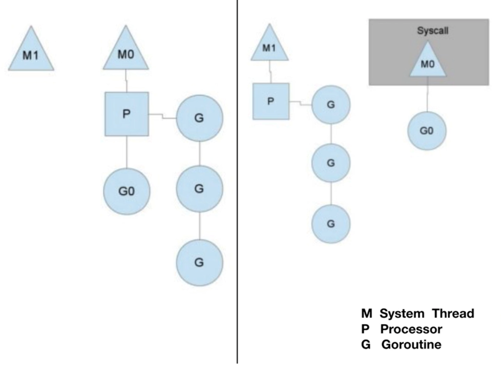
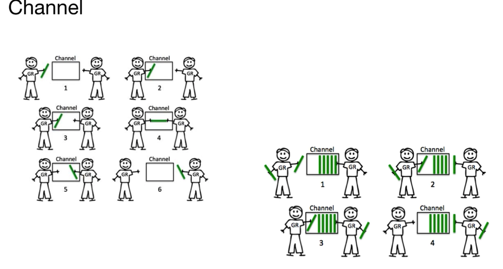

# 并发编程

## Thread vs Groutine

### 创建时默认的 stack 的大小

+ JDK5 以后，Java Thread stack 默认为1M

+ Groutine 的 stack 初始化大小为2K

### 和KSE(Kernel Space Entity) 的对应关系

+ Java Thread 是 1:1
+ Groutine 是 M:N

## CSP 并发机制

[`Communicating Sequential Processes`](https://en.wikipedia.org/wiki/Communicating_sequential_processes)

### CSP vs Actor

+ 和  Actor 的直接通讯不同，CSP模式是通过 Channel 进行通讯的，更加松耦合

+ Go 中的 channel 是有容量限制并且独立于处理 Groutine，而如 Erlang，Actor模式中的mailbox容量是无限的，接收进程也总是被动地处理消息

